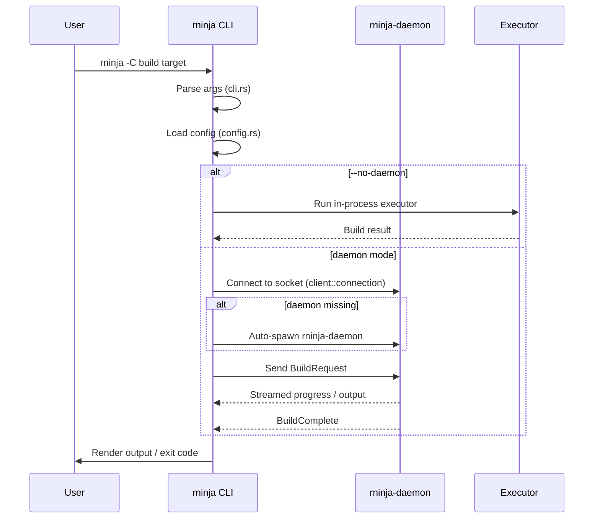

# rninja CLI Architecture

The `rninja` binary is the user-facing entry point. By design it is a thin
client: it parses arguments, loads configuration, decides whether to dispatch
to the daemon or run in single-shot mode, and renders output. The heavy
lifting (parsing manifests, scheduling, executing, caching) lives in the
`rninja` crate library and the daemon component.

## Source layout

The CLI binary lives at [`src/main.rs`](https://github.com/neul-labs/rninja/blob/main/src/main.rs)
and depends on the following modules from the `rninja` library
([`src/lib.rs`](https://github.com/neul-labs/rninja/blob/main/src/lib.rs)):

| Module        | Role in the CLI                                           |
|---------------|-----------------------------------------------------------|
| `cli`         | Argument parsing via `clap` derive                        |
| `config`      | Loading `.rninjarc` / `~/.rninjarc` / XDG config          |
| `client`      | Connecting to a running daemon (or spawning one)          |
| `executor`    | Single-shot fallback when the daemon is disabled          |
| `output`      | Terminal-aware rendering (and `--json` machine output)    |
| `trace`       | Chrome trace writer for `--trace FILE`                    |

## CLI surface

From [`src/cli.rs`](https://github.com/neul-labs/rninja/blob/main/src/cli.rs),
the flags mirror upstream Ninja plus a few rninja-specific additions:

| Flag                  | Mirror of Ninja? | Purpose                            |
|-----------------------|------------------|------------------------------------|
| `-C DIR` / `--dir`    | Yes              | `chdir` before doing anything else |
| `-f FILE` / `--file`  | Yes              | Manifest path (default `build.ninja`) |
| `-j N` / `--jobs`     | Yes              | Parallelism (`0` = unlimited)      |
| `-k N` / `--keep-going` | Yes            | Stop after N failures              |
| `-l N` / `--load-average` | Yes          | Skip new jobs when load is high    |
| `-n` / `--dry-run`    | Yes              | Print commands without running     |
| `-v` / `--verbose`    | Yes              | Show full command lines            |
| `-d MODE` / `--debug` | Yes              | `explain`, `keepdepfile`, `stats`  |
| `-t TOOL` / `--tool`  | Yes              | Subtool dispatch (`-t list`)       |
| `-w FILE` / `--log`   | rninja extension | Experimental build log             |
| `--trace FILE`        | rninja extension | Chrome trace output                |
| `--json` / `--machine`| rninja extension | JSON output for tooling/AI agents  |
| `--no-daemon`         | rninja extension | Force single-shot mode             |
| `--daemon-socket PATH`| rninja extension | Override daemon socket location    |

## Execution flow

## Configuration precedence

Configuration is resolved in this order, sourced from
[`src/config.rs`](https://github.com/neul-labs/rninja/blob/main/src/config.rs):

1. Command-line flags
2. Environment variables (`RNINJA_CACHE_*`, see [Reference > Environment Variables](../../reference/environment-variables.md))
3. Project config: `.rninjarc` in the working directory
4. User config: `~/.rninjarc`
5. XDG user config: `~/.config/rninja/config.toml`
6. Built-in defaults

The first hit wins per key, not per file - so a single flag can override a
single config value without invalidating the rest.

## Output modes

- **Default**: human-readable, ANSI-coloured when stdout is a TTY.
- **`-v`**: full command lines for each build step.
- **`-d explain`**: prints the reason each target is being rebuilt.
- **`-d stats`**: prints cache hit/miss and timing summary on exit.
- **`--json`**: line-delimited JSON; intended for tooling and AI agents.
- **`--trace FILE`**: writes a Chrome `chrome://tracing`-compatible profile.

## Related components

- [rninja-daemon](daemon.md) - the long-running build server.
- [rninja-cached](cached.md) - the optional remote cache server.
- [Reference > CLI Options](../../reference/cli-options.md) - full flag reference.
