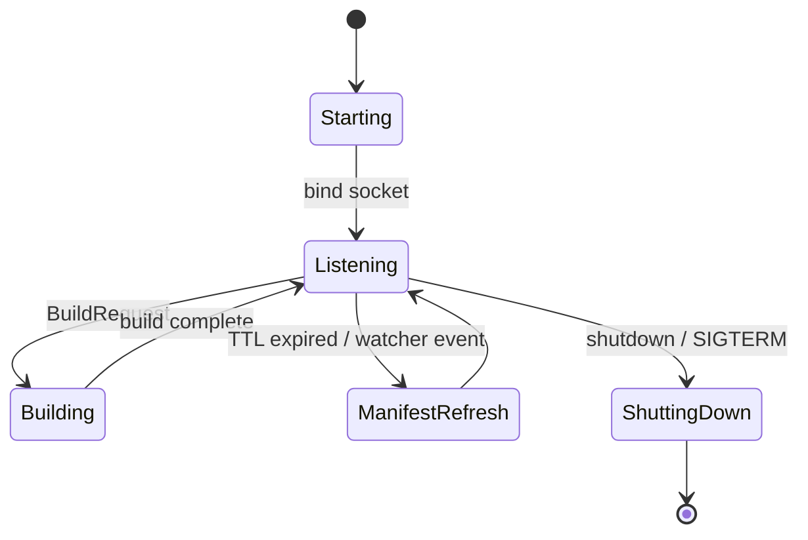

# rninja-daemon Architecture

`rninja-daemon` is the long-running process that holds parsed manifests,
dependency graphs, and build logs in memory between invocations of the CLI.
That is what gives rninja its sub-millisecond no-op build time: on a warm
daemon, the CLI just asks "has anything changed?" and the daemon already
knows.

The binary is defined in
[`src/bin/rninja-daemon.rs`](https://github.com/neul-labs/rninja/blob/main/src/bin/rninja-daemon.rs)
and the implementation lives under
[`src/daemon/`](https://github.com/neul-labs/rninja/tree/main/src/daemon).

## Module layout

From [`src/daemon/mod.rs`](https://github.com/neul-labs/rninja/blob/main/src/daemon/mod.rs):

| Module                    | Purpose                                           |
|---------------------------|---------------------------------------------------|
| `daemon/server.rs`        | NNG-based IPC server and main loop                |
| `daemon/protocol.rs`      | Request/response types, version constant          |
| `daemon/session.rs`       | Per-build session lifecycle (`SessionManager`)    |
| `daemon/state.rs`         | Cached manifests, graphs, build logs (`DaemonState`) |
| `daemon/watcher.rs`       | `notify`-based file watcher for invalidation      |

## Transport

The daemon listens on an NNG `Rep0` socket bound to a Unix domain socket
(or named pipe on Windows). The URL form is
`ipc:///path/to/socket`. The default path is derived from the user identity
and a stable hash, and can be overridden with
`--daemon-socket` on the CLI or `RNINJA_DAEMON_SOCKET` in the environment.

Wire format is MessagePack with a 4-byte big-endian length prefix. See
[Reference > IPC Protocol](../../reference/api/ipc-protocol.md) for the
request/response schema.

## Cached state

`DaemonState` (in `daemon/state.rs`) maintains one `CachedManifest` per
build directory:

```rust
struct CachedManifest {
    manifest:       Arc<Manifest>,        // parsed build.ninja
    graph:          Arc<Graph>,            // dependency DAG
    build_log:      Arc<RwLock<BuildLog>>, // hashes of last-built outputs
    fingerprint:    u64,                   // hash of build.ninja
    last_validated: Instant,
    included_files: Vec<PathBuf>,          // for the file watcher
}
```

Defaults from `DaemonConfig`:

- `max_cached_manifests`: 100
- `manifest_ttl_secs`: 300 (revalidation interval)
- `max_concurrent_builds`: 4

## Lifecycle



## Concurrency

- One NNG socket, one accept loop.
- `SessionManager` caps concurrent builds at `max_concurrent_builds`.
- Each session gets a UUID, isolated state, and independent failure handling.
- The file watcher runs on its own thread and posts events into the daemon.

## Auto-spawn

The CLI spawns the daemon on demand when it cannot connect to an existing
socket. This means users never have to run `rninja-daemon` manually -
the daemon's existence is an implementation detail of the CLI's
performance, not a deployment step.

`--no-daemon` (or short-lived environments like CI) bypasses this and
runs the executor in-process.

## Multi-repo support

A single daemon can serve any number of build directories. Each repository
gets its own `CachedManifest` entry keyed on the absolute path. The file
watcher tracks every included file across all cached manifests and
invalidates entries on change.

See [Daemon > Multi-Repository Support](../../daemon/multi-repo.md) for
operational notes.

## Failure modes

- **Stale socket file**: removed on startup before binding (`server.rs`).
- **NNG bind failure**: logged and the process exits non-zero.
- **Watcher exhaustion**: falls back to TTL-based revalidation.
- **Auth requirement misconfigured**: daemon exits with an explicit error
  rather than silently allowing anonymous access.

## Related

- [Daemon > Overview](../../daemon/overview.md) - user-facing operational guide.
- [Daemon > Auto-Spawn](../../daemon/auto-spawn.md) - how the CLI starts the daemon.
- [Reference > IPC Protocol](../../reference/api/ipc-protocol.md) - wire format.
