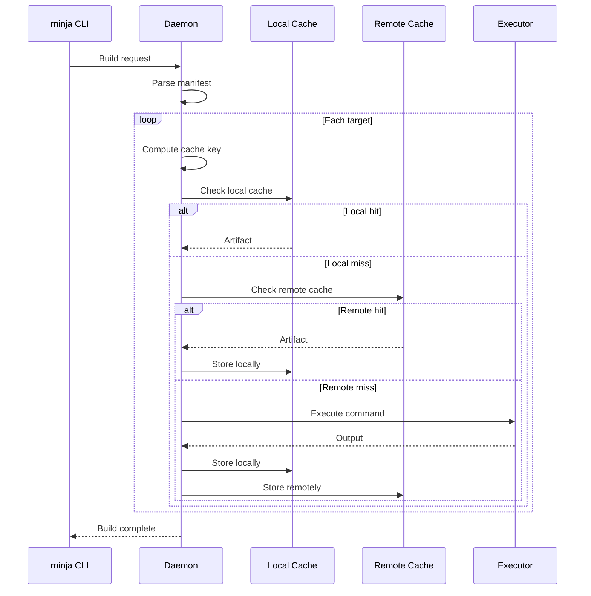

# Data Flow

How requests flow through rninja.

## Build Request Flow



## Cache Key Computation

```
key = BLAKE3(
    rule_name +
    command +
    input_hashes +
    env_vars
)
```

## Artifact Storage

```
~/.cache/rninja/
├── index/          # Key → blob mapping
└── blobs/
    └── ab/
        └── abcdef...  # Content-addressed blobs
```
