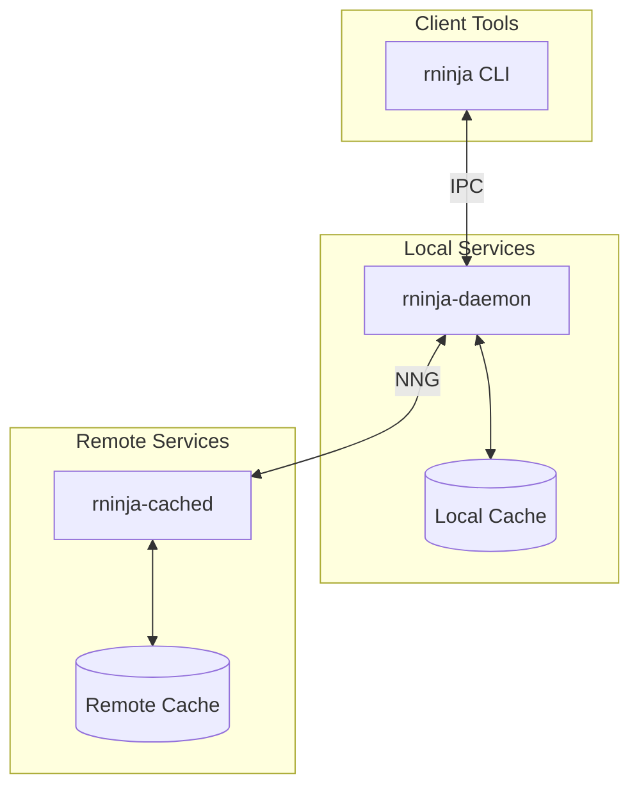

# Architecture Overview

High-level architecture of the rninja system.

## Components

## Core Components

### rninja CLI

Main user interface. Parses commands, connects to daemon, executes builds.

### rninja-daemon

Long-running process that:

- Caches parsed manifests
- Manages build execution
- Coordinates cache access

### rninja-cached

Remote cache server:

- Stores shared artifacts
- Handles authentication
- Manages storage

## Data Flow

1. User runs `rninja`
2. CLI connects to daemon
3. Daemon parses manifest (or uses cache)
4. For each target:
   - Compute cache key
   - Check cache (local, then remote)
   - Execute or restore
   - Store result in cache
5. Return results to CLI

## Key Technologies

| Component | Technology |
|-----------|------------|
| Runtime | Tokio (async) |
| Database | sled |
| Hashing | BLAKE3 |
| Network | NNG |
| Serialization | rkyv, MessagePack |
