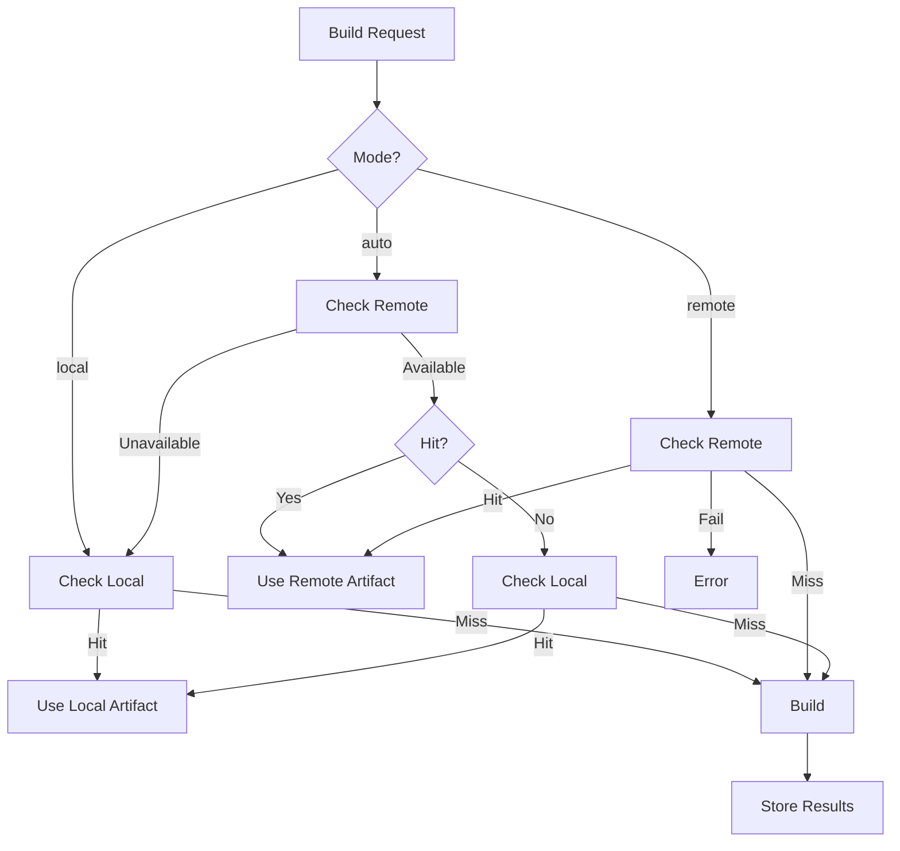

# Cache Modes

rninja supports three cache operation modes that control how local and remote caches interact.

## Available Modes

### Local Mode

```bash
export RNINJA_CACHE_MODE=local
```

Uses only the local cache on your machine.

**Behavior:**

- Check local cache for artifacts
- Store new artifacts locally
- Never contact remote cache

**Use When:**

- Working offline
- No remote cache available
- Testing local-only performance
- Privacy requirements

### Remote Mode

```bash
export RNINJA_CACHE_MODE=remote
```

Uses only the remote cache server.

**Behavior:**

- Check remote cache for artifacts
- Store new artifacts remotely
- Fail if remote cache unavailable
- No local caching

**Use When:**

- CI runners with shared cache
- Ephemeral build environments
- Centralized cache management
- Disk-constrained machines

!!! warning "Network Dependency"
    Remote mode fails if the cache server is unreachable. Use `auto` for resilience.

### Auto Mode (Recommended)

```bash
export RNINJA_CACHE_MODE=auto
```

Intelligent fallback between remote and local.

**Behavior:**

1. Try remote cache first
2. Fall back to local on remote failure
3. Store to both caches when possible
4. Graceful degradation on errors

**Use When:**

- Team development (default)
- CI with potential network issues
- Maximum cache utilization
- Best of both worlds

## Configuration

### Environment Variable

```bash
export RNINJA_CACHE_MODE=auto  # or local, remote
```

### Config File

```toml
[cache]
mode = "auto"  # or "local", "remote"
```

### Per-Build Override

```bash
RNINJA_CACHE_MODE=local rninja
```

## Mode Comparison

| Feature | Local | Remote | Auto |
|---------|-------|--------|------|
| Network required | No | Yes | No (fallback) |
| Shared with team | No | Yes | Yes |
| Works offline | Yes | No | Yes |
| Disk usage | Higher | Lower | Medium |
| Latency | Lowest | Higher | Adaptive |
| Resilience | High | Low | High |

## Push and Pull Policies

Fine-tune cache behavior with policies:

### Push Policy

When to upload artifacts to remote cache:

```bash
export RNINJA_CACHE_PUSH_POLICY=on_success  # default
```

| Policy | Description |
|--------|-------------|
| `never` | Never push to remote |
| `on_success` | Push successful builds only (default) |
| `always` | Push all builds |

### Pull Policy

When to download artifacts from remote cache:

```bash
export RNINJA_CACHE_PULL_POLICY=always  # default
```

| Policy | Description |
|--------|-------------|
| `always` | Always try remote first (default) |
| `on_miss` | Only check remote on local miss |
| `never` | Never pull from remote (push-only) |

## Common Configurations

### Development Machine

```bash
# Use auto for team sharing with local fallback
export RNINJA_CACHE_MODE=auto
export RNINJA_CACHE_PUSH_POLICY=on_success
export RNINJA_CACHE_PULL_POLICY=always
```

### CI Runner

```bash
# Remote-first for shared cache
export RNINJA_CACHE_MODE=auto
export RNINJA_CACHE_PUSH_POLICY=always
export RNINJA_CACHE_PULL_POLICY=always
```

### Offline Development

```bash
# Local only
export RNINJA_CACHE_MODE=local
```

### Pull-Only Client

For machines that shouldn't contribute to cache:

```bash
export RNINJA_CACHE_MODE=auto
export RNINJA_CACHE_PUSH_POLICY=never
export RNINJA_CACHE_PULL_POLICY=always
```

### Push-Only CI

For CI that populates but doesn't consume:

```bash
export RNINJA_CACHE_MODE=auto
export RNINJA_CACHE_PUSH_POLICY=always
export RNINJA_CACHE_PULL_POLICY=never
```

## Mode Selection Flowchart



## Troubleshooting Modes

### Auto Mode Not Using Remote

Check configuration:

```bash
# Verify remote is configured
echo $RNINJA_CACHE_REMOTE_SERVER
echo $RNINJA_CACHE_TOKEN

# Check connectivity
nc -zv cache.internal 9999
```

### Remote Mode Failing

```bash
# Switch to auto for resilience
export RNINJA_CACHE_MODE=auto

# Or check server status
curl -v tcp://cache.internal:9999
```

### Local Mode Cache Growing

```bash
# Set size limit
export RNINJA_CACHE_MAX_SIZE=5G

# Run cleanup
rninja -t cache-gc
```

## Best Practices

### Use Auto by Default

Most teams should use `auto`:

```bash
export RNINJA_CACHE_MODE=auto
```

### Configure Policies for CI

```bash
# CI that builds main branch should push
if [ "$CI_BRANCH" = "main" ]; then
    export RNINJA_CACHE_PUSH_POLICY=always
else
    export RNINJA_CACHE_PUSH_POLICY=on_success
fi
```

### Monitor Mode Behavior

Check which cache is being used:

```bash
rninja -t cache-stats
# Shows local and remote hit rates separately
```
