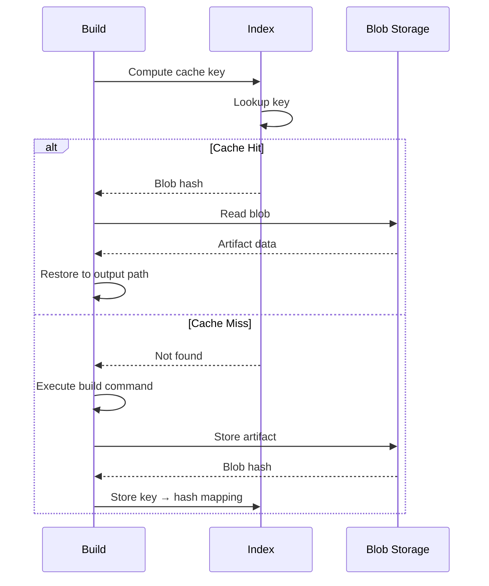

# How Local Caching Works

rninja's local cache stores build artifacts on your machine for fast retrieval.

## Architecture

```
~/.cache/rninja/
├── index/          # sled database (metadata)
│   ├── db/         # Database files
│   └── conf        # Configuration
└── blobs/          # Content-addressed artifacts
    ├── ab/
    │   └── abcdef123...
    └── cd/
        └── cdef456...
```

### Index Database

The index is a [sled](https://github.com/spacejam/sled) embedded database storing:

- Cache key to blob mapping
- Metadata (timestamps, sizes)
- Build information

**Properties:**

- ACID transactions
- Crash-safe
- Fast lookups (B+ tree)

### Blob Storage

Artifacts are stored in content-addressed blobs:

- Files named by their BLAKE3 hash
- Organized in subdirectories by hash prefix
- Deduplication (identical files share storage)

## Content Addressing

### Hash Computation

rninja computes a cache key by hashing:

```
BLAKE3(
    rule_name +
    command_line +
    input_file_contents +
    input_file_mtimes +
    environment_variables +
    compiler_version
)
```

### What's Included

| Input | Description |
|-------|-------------|
| Rule name | The ninja rule (cc, cxx, link, etc.) |
| Command | Full command line with all flags |
| Source files | Content of all input files |
| Headers | Content of included headers (via depfile) |
| Environment | Relevant environment variables |

### What's NOT Included

- File paths (only contents matter)
- Timestamps (content-based, not time-based)
- Machine-specific paths (normalized)

## Cache Operations

### Lookup Flow



### Store Flow

1. Build command executes
2. Output artifact collected
3. Artifact hashed (BLAKE3)
4. Blob stored (if not exists)
5. Index updated with key → hash

### Restore Flow

1. Cache key computed
2. Index lookup
3. Blob hash retrieved
4. Blob read from storage
5. Artifact restored to output path

## BLAKE3 Hashing

rninja uses BLAKE3 for hashing because:

- **Fast**: ~3x faster than SHA-256
- **Secure**: Cryptographic strength
- **Parallelizable**: Uses all CPU cores
- **Streaming**: Handles large files efficiently

```
BLAKE3 Performance:
- Small files: ~6 GB/s
- Large files: ~12 GB/s (parallel)
```

## Sled Database

The sled database provides:

- **ACID guarantees**: Safe from corruption
- **Crash recovery**: Survives unexpected shutdowns
- **Efficient lookups**: O(log n) access
- **Compression**: Reduced storage footprint

### Schema

```
Key: [build_key_hash: 32 bytes]
Value: {
    blob_hash: [32 bytes],
    metadata: {
        created: timestamp,
        size: u64,
        access_count: u32,
    }
}
```

## Deduplication

Content-addressed storage provides automatic deduplication:

```
file1.o (100 KB) ─┐
                  ├─→ blob:abc123 (100 KB)
file2.o (100 KB) ─┘   (stored once)
```

Benefits:

- Reduced storage
- Faster cache population
- Efficient for similar builds

## Cache Invalidation

Cache entries are invalidated when:

1. **Input changes**: Any input file modified
2. **Command changes**: Compiler flags differ
3. **Environment changes**: Relevant env vars differ
4. **Manual GC**: `rninja -t cache-gc`
5. **Age limit**: Entry older than max_age
6. **Size limit**: Cache exceeds max_size

### Garbage Collection

```bash
rninja -t cache-gc
```

GC removes:

- Entries exceeding max_age
- Oldest entries when exceeding max_size
- Orphaned blobs
- Corrupt entries

## Performance Characteristics

### Lookup Time

- Index lookup: ~10-50 μs
- Blob read: ~100 μs - 10 ms (depends on size)

### Store Time

- Hash computation: ~1 ms per MB
- Blob write: ~1 ms per MB
- Index update: ~50 μs

### Space Efficiency

- Index: ~100 bytes per entry
- Blobs: Actual artifact size
- Overhead: <1% typically

## Durability

### Crash Safety

Sled provides:

- Write-ahead logging
- Atomic transactions
- Recovery on startup

### Data Integrity

- BLAKE3 verifies blob integrity
- Database checksums
- Automatic corruption detection

## Monitoring

### Statistics

```bash
rninja -t cache-stats
```

Shows:

- Total entries
- Total size
- Hit rate
- Session statistics

### Health Check

```bash
rninja -t cache-health
```

Verifies:

- Database integrity
- Blob storage health
- Index consistency

## Next Steps

<div class="grid cards" markdown>

-   :material-cog: [__Configuration__](configuration.md)

    Configure local cache settings

-   :material-broom: [__Management__](management.md)

    Manage and maintain the cache

</div>
