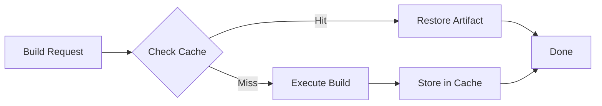

# Caching Overview

rninja's built-in caching system is one of its most powerful features, dramatically reducing build times by reusing previously built artifacts.

## How Caching Works



1. **Hash Inputs**: rninja computes a hash of all inputs (source files, headers, compiler flags, environment)
2. **Check Cache**: The hash is used to look up cached artifacts
3. **Cache Hit**: If found, artifacts are restored instead of rebuilding
4. **Cache Miss**: If not found, the build executes normally
5. **Store Results**: New artifacts are stored in the cache for future use

## Key Benefits

### Faster Clean Builds

After `clean`, rebuilds are nearly instant:

```bash
rninja -t clean
rninja  # Restores from cache, not recompiling
```

### Branch Switching

Cache persists across branches:

```bash
git checkout feature-branch
rninja  # Uses cached artifacts from previous builds

git checkout main
rninja  # Also uses cache
```

### CI/CD Acceleration

With remote caching, CI builds benefit from previous builds:

- First build: Populates cache
- Subsequent builds: Cache hits reduce build time

### Distributed Development

Teams can share cached artifacts:

- Developer A builds and caches
- Developer B gets cache hits
- Everyone benefits from shared work

## Cache Types

### Local Cache

Stored on your machine, enabled by default.

```
~/.cache/rninja/
├── index/    # Metadata database (sled)
└── blobs/    # Artifact storage
```

Benefits:

- No setup required
- Works offline
- Fast (local disk)

### Remote Cache

Shared across machines via `rninja-cached` server.

```
[Developer A] --> [Cache Server] <-- [Developer B]
                       ^
                       |
                    [CI/CD]
```

Benefits:

- Team-wide sharing
- CI acceleration
- Distributed cache hits

## Cache Modes

| Mode | Description |
|------|-------------|
| `local` | Local cache only |
| `remote` | Remote cache only (fail if unavailable) |
| `auto` | Try remote first, fall back to local |

Set via environment or config:

```bash
export RNINJA_CACHE_MODE=auto
```

## Content Addressing

rninja uses content-addressed storage:

- **BLAKE3** hashing for security and speed
- **Deterministic**: Same inputs always produce same hash
- **Correct**: Hash changes when any input changes

### What's Hashed

- Source file contents
- Header file contents
- Compiler command
- Environment variables (relevant ones)
- Compiler version

### Why This Matters

- **Reproducible**: Same inputs = same outputs
- **Safe**: No false cache hits
- **Efficient**: Deduplication of identical artifacts

## Performance Impact

| Scenario | Without Cache | With Cache | Improvement |
|----------|---------------|------------|-------------|
| Clean build | Full rebuild | ~Instant | 10-100x |
| Branch switch | Full rebuild | Cache hits | 2-5x |
| CI (2nd run) | Full rebuild | Cache hits | 2-5x |
| No-op | Check files | Check hashes | 23x |

## Quick Start

### Enable Local Caching

Enabled by default. Verify:

```bash
rninja -t cache-stats
```

### Check Cache Performance

After a build:

```bash
rninja -t cache-stats
# Look at hit rate
```

### Set Up Remote Caching

```bash
export RNINJA_CACHE_REMOTE_SERVER=tcp://cache.internal:9999
export RNINJA_CACHE_TOKEN=your-token
export RNINJA_CACHE_MODE=auto

rninja
```

## When Caching Helps Most

- **Large projects**: More targets to cache
- **Frequent rebuilds**: More opportunities for hits
- **Team development**: Shared work benefits everyone
- **CI/CD**: Repeated builds across runners

## When Caching Helps Less

- **Small projects**: Fast builds anyway
- **Unique builds**: No repeated work
- **Highly dynamic**: Inputs change constantly

## Next Steps

<div class="grid cards" markdown>

-   :material-cached: [__Local Cache__](local/how-it-works.md)

    Deep dive into local caching

-   :material-cloud: [__Remote Cache__](remote/quick-setup.md)

    Set up shared caching

-   :material-tune: [__Cache Modes__](cache-modes.md)

    Configure cache behavior

-   :material-wrench: [__Troubleshooting__](troubleshooting.md)

    Solve caching issues

</div>
