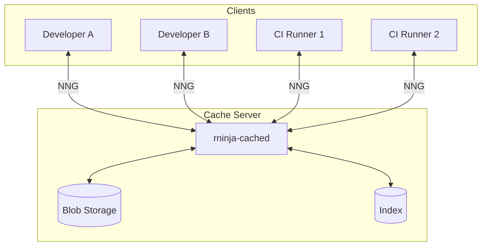
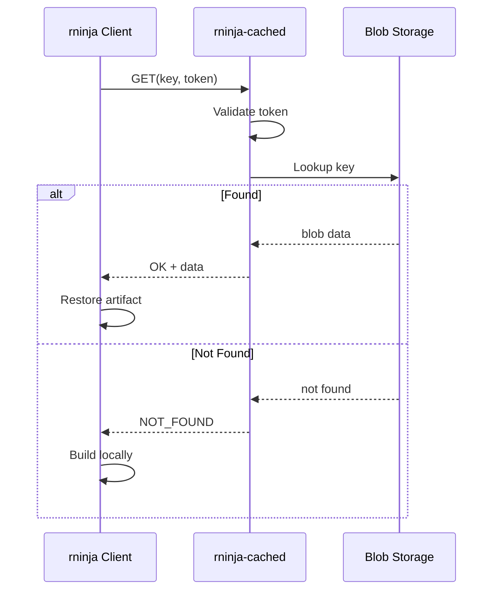
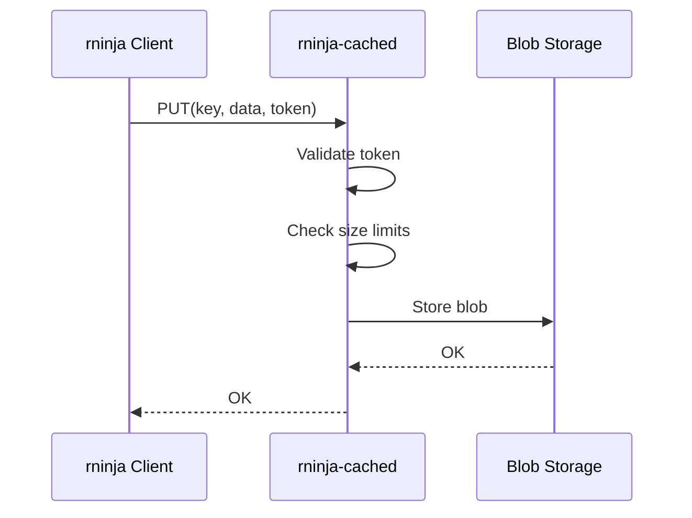

# Remote Cache Architecture

rninja's remote cache enables artifact sharing across machines using a dedicated cache server.

## Overview



## Components

### rninja-cached Server

The cache server (`rninja-cached`) provides:

- **Artifact storage**: Content-addressed blob storage
- **Index management**: Fast key-value lookups
- **Authentication**: Token-based access control
- **Rate limiting**: Protects against overload
- **Garbage collection**: Automatic cleanup

### Client Integration

The rninja client:

- Connects to server via NNG (nanomsg)
- Sends cache lookups and stores
- Handles connection failures gracefully
- Falls back to local cache when needed

## Network Protocol

### NNG Transport

rninja uses [NNG](https://nng.nanomsg.org/) (nanomsg next-gen) for communication:

- **Protocol**: Request/Reply pattern
- **Transport**: TCP with optional TLS
- **Serialization**: MessagePack

### Message Format

```
Request:
{
    "type": "get" | "put",
    "key": [32 bytes],
    "token": "auth-token",
    "data": [bytes, for put only]
}

Response:
{
    "status": "ok" | "not_found" | "error",
    "data": [bytes, for get only],
    "message": "error message, if error"
}
```

## Data Flow

### Cache Lookup (Pull)



### Cache Store (Push)



## Storage Architecture

### Server Storage

```
/var/lib/rninja-cache/
├── index/          # sled database
│   ├── db/
│   └── conf
└── blobs/          # Content-addressed storage
    ├── ab/
    │   └── abcdef123...
    └── cd/
        └── cdef456...
```

### Content Addressing

Same as local cache:

- BLAKE3 hash of cache key
- Deduplication across all clients
- Efficient storage utilization

## Security Model

### Authentication

```
Client → Server: Request + Token
Server: Validate(Token) → Allow/Deny
```

Tokens are:

- Pre-shared secrets
- Configured per-client or team
- Validated on every request

### Authorization

Current model is simple:

- Valid token = full access
- Invalid token = denied

Future: Role-based access control

### Transport Security

Options:

1. **Plain TCP**: Internal networks only
2. **TLS termination**: Via reverse proxy (nginx, HAProxy)
3. **VPN/Wireguard**: Network-level encryption

## Fault Tolerance

### Client-Side

- Connection timeout handling
- Automatic retry with backoff
- Fallback to local cache
- Graceful degradation

### Server-Side

- Crash recovery (sled durability)
- Automatic index repair
- Health check endpoint

## Scaling Considerations

### Single Server

Suitable for:

- Small to medium teams (<50 developers)
- Moderate build sizes
- Single geographic location

### Multiple Servers

For larger deployments:

- Geographic distribution
- Load balancing
- Replication (planned feature)

## Performance Characteristics

### Latency

| Operation | Typical Latency |
|-----------|-----------------|
| Lookup (hit) | 5-50 ms |
| Lookup (miss) | 1-5 ms |
| Store (1 MB) | 10-100 ms |
| Store (10 MB) | 100-500 ms |

### Throughput

Single server can handle:

- ~1000 requests/second (lookups)
- ~100 MB/second (stores, depends on storage)

### Bandwidth

Consider:

- Artifact sizes (typically 1 KB - 10 MB)
- Number of concurrent builds
- Network capacity

## Deployment Options

### Standalone Server

```bash
rninja-cached \
    --listen tcp://0.0.0.0:9999 \
    --storage /var/lib/rninja-cache \
    --tokens "token1,token2"
```

### Containerized

```yaml
# docker-compose.yml
services:
  rninja-cache:
    image: neullabs/rninja-cached
    ports:
      - "9999:9999"
    volumes:
      - cache-data:/data
```

### Kubernetes

```yaml
apiVersion: apps/v1
kind: Deployment
metadata:
  name: rninja-cache
spec:
  replicas: 1
  template:
    spec:
      containers:
        - name: rninja-cached
          image: neullabs/rninja-cached
          ports:
            - containerPort: 9999
```

## Next Steps

<div class="grid cards" markdown>

-   :material-rocket-launch: [__Quick Setup__](quick-setup.md)

    Get started with remote caching

-   :material-server: [__Deployment__](deployment.md)

    Full deployment guide

-   :material-shield-key: [__Authentication__](authentication.md)

    Configure access control

</div>
