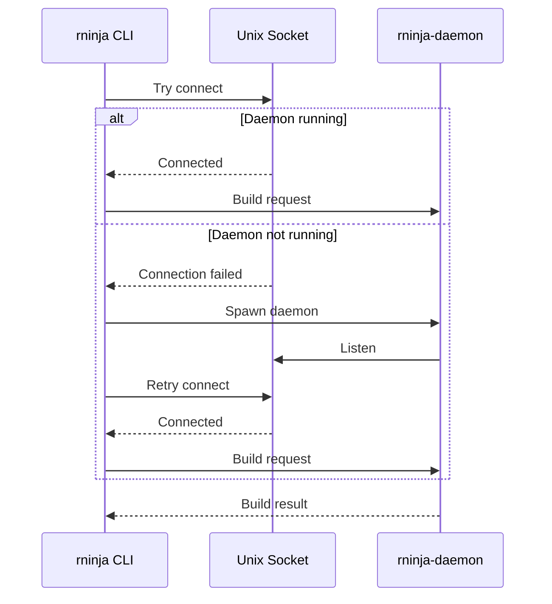

# Auto-Spawn Behavior

rninja automatically spawns and manages the daemon process.

## How Auto-Spawn Works



## Default Behavior

When you run `rninja`:

1. **Try to connect** to existing daemon socket
2. **If connected**: Send build request
3. **If not connected**:
   - Spawn new daemon process
   - Wait for socket to be ready
   - Connect and send request

```bash
# First run: spawns daemon
$ rninja
[daemon spawned]
[build output...]

# Second run: uses existing daemon
$ rninja
[build output...]  # Faster startup
```

## Socket Location

### Default Path

```
Linux:   /tmp/rninja-daemon.sock
macOS:   /tmp/rninja-daemon.sock
```

### Custom Path

```bash
rninja --daemon-socket /custom/path/daemon.sock
```

Useful for:

- Multiple daemon instances
- Custom permissions
- Testing

## Daemon Lifecycle

### Startup

Daemon starts when:

- First `rninja` invocation (auto-spawn)
- Explicit `rninja-daemon` command
- System service start

### Running

Daemon stays running:

- Handles multiple build requests
- Maintains cached state
- Listens on socket

### Shutdown

Daemon stops when:

- Explicitly killed (`pkill rninja-daemon`)
- System shutdown
- Socket becomes invalid
- Idle timeout (if configured)

## Controlling Auto-Spawn

### Disable Auto-Spawn

```bash
# Single-shot mode, no daemon
rninja --no-daemon
```

### Pre-Spawn Daemon

```bash
# Start daemon first
rninja-daemon &

# Then run builds
rninja
```

### Environment Variable

```bash
# Future feature
export RNINJA_NO_DAEMON=1
rninja  # Runs without daemon
```

## Multiple Daemons

### Per-User Daemon

Default behavior - one daemon per user:

```bash
# User A
/tmp/rninja-daemon.sock

# User B (different socket)
/tmp/rninja-daemon-userB.sock
```

### Per-Project Daemon

Use custom sockets:

```bash
# Project A
rninja --daemon-socket /tmp/project-a.sock

# Project B
rninja --daemon-socket /tmp/project-b.sock
```

## Troubleshooting Auto-Spawn

### Daemon Not Starting

```bash
# Check for errors
rninja-daemon --foreground

# Check socket permissions
ls -la /tmp/rninja-daemon.sock
```

### Multiple Daemons Running

```bash
# Find all daemon processes
pgrep -fa rninja-daemon

# Kill all
pkill -f rninja-daemon

# Start fresh
rninja
```

### Stale Socket

```bash
# Remove stale socket
rm /tmp/rninja-daemon.sock

# Daemon will restart on next invocation
rninja
```

## Performance Impact

### With Auto-Spawn

| Invocation | Startup Time |
|------------|--------------|
| First (spawns daemon) | ~100-200 ms |
| Subsequent | ~5-20 ms |

### Without Daemon

| Invocation | Startup Time |
|------------|--------------|
| Every build | ~100-200 ms |

## Best Practices

### Let Auto-Spawn Work

For most use cases, default behavior is optimal:

```bash
rninja  # Just works
```

### Pre-Warm for Speed

If first-build latency matters:

```bash
# In shell startup or project init
rninja-daemon &
```

### CI Considerations

In CI, daemon may not help:

```bash
# CI job - single build, no benefit from daemon
rninja --no-daemon
```

Or keep daemon if runner is persistent:

```bash
# Persistent runner - daemon helps
rninja  # Let auto-spawn work
```
