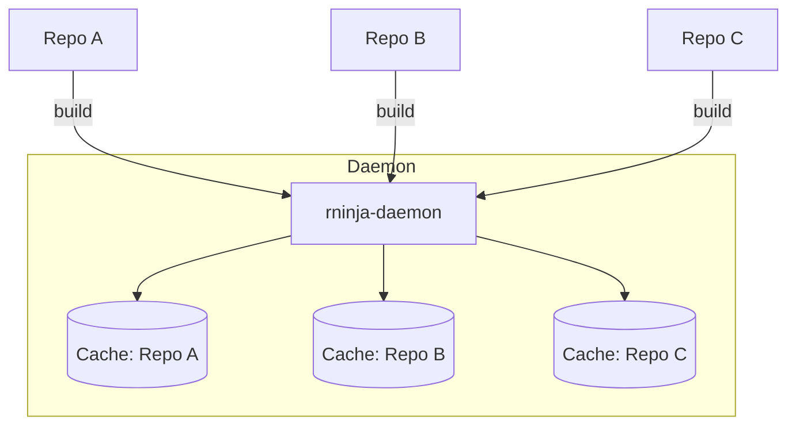

# Multi-Repository Support

The rninja daemon efficiently handles builds across multiple repositories.

## How It Works

A single daemon can serve builds from different repositories:



## Namespace Isolation

Each repository gets isolated state:

- **Build manifest**: Parsed separately per directory
- **File cache**: Isolated per working directory
- **Build cache**: Shared (content-addressed)

```bash
# Build in repo A
cd ~/projects/repo-a
rninja

# Build in repo B (same daemon, isolated state)
cd ~/projects/repo-b
rninja
```

## Benefits

### Shared Resources

- Single daemon process for all repos
- Shared memory pool
- Coordinated disk access

### Content Deduplication

If repos share similar code:

```
Repo A: libcommon.a (hash: abc123)
Repo B: libcommon.a (hash: abc123)  # Same content

Cache: stores once, both repos get hits
```

### Fast Context Switching

Switch between repos without restart penalty:

```bash
cd repo-a && rninja  # Fast
cd repo-b && rninja  # Also fast
cd repo-a && rninja  # Still fast (cached)
```

## Concurrent Builds

Build multiple repos simultaneously:

```bash
# Terminal 1
cd ~/projects/repo-a
rninja

# Terminal 2 (same time)
cd ~/projects/repo-b
rninja
```

The daemon coordinates:

- Independent build sessions
- Shared cache access
- Resource management

## Configuration

### Per-Repo Settings

Settings are resolved per working directory:

```bash
# repo-a/.rninjarc
[build]
jobs = 4

# repo-b/.rninjarc
[build]
jobs = 8
```

### Shared Daemon Socket

Default: All repos use same daemon socket

```bash
# Both repos use same daemon
cd ~/repo-a && rninja
cd ~/repo-b && rninja
```

### Separate Daemons (Advanced)

If needed, run separate daemons:

```bash
# Repo A with dedicated daemon
rninja --daemon-socket /tmp/repo-a-daemon.sock

# Repo B with different daemon
rninja --daemon-socket /tmp/repo-b-daemon.sock
```

## Monorepo Considerations

For monorepos with multiple build directories:

```bash
monorepo/
├── build.ninja           # Root
├── frontend/
│   └── build.ninja       # Frontend
└── backend/
    └── build.ninja       # Backend
```

```bash
# All use same daemon
rninja -C frontend
rninja -C backend
rninja  # Root build
```

## Resource Management

### Memory Usage

Daemon caches manifest data per repo:

```
Memory ≈ Base + (Repos × Manifest Size)

Example:
- Base: 50 MB
- 5 repos × 10 MB each = 50 MB
- Total: ~100 MB
```

### Limiting Cached Repos

```bash
# Start daemon with limit
rninja-daemon --max-cached 10
```

Older repos evicted when limit reached.

## Best Practices

### Use Single Daemon

For most users, one daemon is sufficient:

```bash
# Let auto-spawn handle it
rninja
```

### Project-Specific When Needed

For isolation (e.g., different toolchains):

```bash
# Project needing specific environment
RNINJA_DAEMON_SOCKET=/tmp/special-project.sock rninja
```

### CI Runners

Each runner can have its own daemon:

```yaml
# Runner 1
RNINJA_DAEMON_SOCKET: /tmp/runner-1.sock

# Runner 2
RNINJA_DAEMON_SOCKET: /tmp/runner-2.sock
```

## Troubleshooting

### Wrong Repo State

If builds seem to use wrong state:

```bash
# Verify working directory
pwd

# Force daemon to reload
pkill -f rninja-daemon
rninja
```

### Cache Confusion

If cache seems shared incorrectly:

```bash
# Check cache stats per repo
cd repo-a && rninja -t cache-stats
cd repo-b && rninja -t cache-stats
```

### Resource Contention

If many repos cause slowdown:

```bash
# Limit concurrent builds
rninja-daemon --max-builds 2
```
