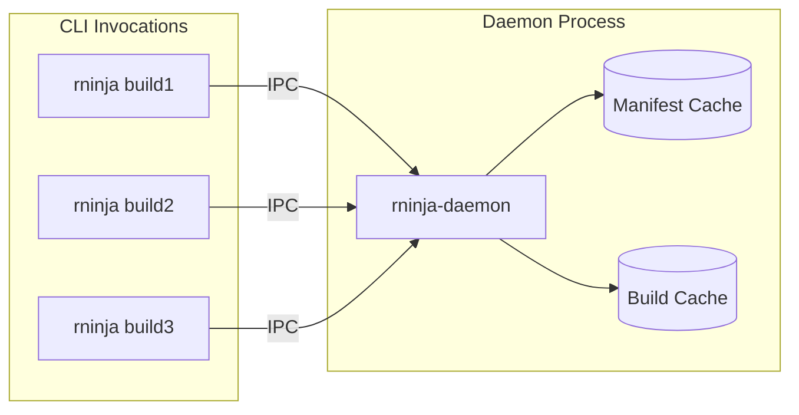

# Daemon Overview

rninja's daemon architecture provides faster builds through persistent state and optimized resource usage.

## What is the Daemon?

The rninja daemon (`rninja-daemon`) is a long-running background process that:

- **Caches parsed manifests**: Avoids re-parsing `build.ninja` on every invocation
- **Maintains state**: Keeps file system caches warm
- **Handles requests**: Serves multiple `rninja` invocations
- **Manages resources**: Coordinates parallel builds

## Architecture



## Benefits

### Faster Startup

Without daemon:

```
Parse manifest → Build graph → Check files → Execute → Done
     ~100ms          ~50ms         ~50ms
```

With daemon:

```
Connect → Check files → Execute → Done
  ~5ms       ~10ms
```

### Resource Efficiency

- Single daemon handles all builds
- Shared memory for manifest data
- Coordinated disk access
- Better CPU utilization

### Consistent State

- File system cache stays warm
- Build graph always ready
- Faster dependency checking

## How It Works

### Auto-Spawn

When you run `rninja`, it:

1. Checks if daemon is running
2. If not, spawns daemon automatically
3. Connects and sends build request
4. Daemon executes build
5. Results returned to CLI

```bash
# First invocation starts daemon
rninja

# Subsequent invocations connect to existing daemon
rninja
rninja
```

### Socket Communication

Communication uses Unix domain sockets:

```
Default: /tmp/rninja-daemon.sock
Custom:  --daemon-socket /path/to/socket
```

### Session Management

Each build request creates a session:

- Isolated build state
- Separate output streams
- Independent failure handling

## When Daemon Helps Most

- **Repeated builds**: Same project, many invocations
- **Watch mode**: Fast rebuilds on file changes
- **IDE integration**: Continuous compilation feedback
- **CI with warm runners**: Persistent build environment

## When to Disable

Use `--no-daemon` when:

- Running in containers (ephemeral environment)
- Debugging build issues
- Single-shot CI jobs
- Resource-constrained systems

```bash
rninja --no-daemon
```

## Quick Start

### Default Usage (Recommended)

Just run rninja normally:

```bash
rninja  # Daemon auto-spawns if needed
```

### Check Daemon Status

```bash
# See if daemon is running
pgrep -f rninja-daemon
```

### Explicit Daemon Control

```bash
# Start daemon manually
rninja-daemon &

# Stop daemon
pkill -f rninja-daemon
```

## Next Steps

<div class="grid cards" markdown>

-   :material-play: [__Auto-Spawn__](auto-spawn.md)

    How automatic daemon spawning works

-   :material-folder-multiple: [__Multi-Repo__](multi-repo.md)

    Working with multiple repositories

-   :material-cog: [__Management__](management.md)

    Managing the daemon process

-   :material-close-circle: [__Single-Shot Mode__](single-shot.md)

    Running without the daemon

</div>
