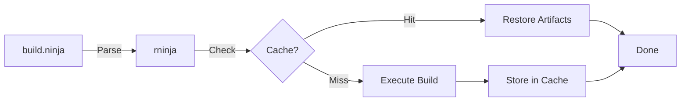

# rninja

<div class="hero" markdown>

## Build Faster. Cache Smarter. Drop-in Ready.

A Rust-powered drop-in replacement for [Ninja](https://ninja-build.org/)
with built-in caching and modern scheduling. Cut your build times without changing your build files.

[Get Started](getting-started/quick-start.md){ .md-button .md-button--primary }
[View on GitHub :fontawesome-brands-github:](https://github.com/neul-labs/rninja){ .md-button }

</div>

---

<div class="grid cards" markdown>

-   :material-clock-fast:{ .lg .middle } __23x Faster No-op Builds__

    ---

    Sub-millisecond detection when nothing needs rebuilding.
    No more waiting for build systems to check thousands of files.

    [:octicons-arrow-right-24: See benchmarks](performance/benchmarks.md)

-   :material-cached:{ .lg .middle } __Content-Addressed Caching__

    ---

    BLAKE3 hashing ensures correct, reproducible builds.
    Automatic cache restoration for repeated builds.

    [:octicons-arrow-right-24: Learn about caching](caching/overview.md)

-   :material-cloud-sync:{ .lg .middle } __Remote Cache Sharing__

    ---

    Share build artifacts across your team and CI runners.
    Dramatically reduce CI build times with shared caches.

    [:octicons-arrow-right-24: Set up remote cache](caching/remote/quick-setup.md)

-   :material-puzzle:{ .lg .middle } __Drop-in Compatible__

    ---

    Works with existing `.ninja` files from CMake, Meson, GN, or any generator.
    No changes to your build configuration required.

    [:octicons-arrow-right-24: Migration guide](getting-started/migration.md)

</div>

---

## Quick Install

=== "Cargo"

    ```bash
    cargo install rninja
    ```

=== "From Source"

    ```bash
    git clone https://github.com/neul-labs/rninja
    cd rninja
    cargo install --path .
    ```

=== "Symlink as Ninja"

    ```bash
    # After installing rninja
    ln -s $(which rninja) /usr/local/bin/ninja
    ```

---

## Quick Start

rninja works exactly like ninja - just swap the binary:

```bash
# Use directly
rninja

# Or with your existing workflow
rninja -C out/Release
rninja -j8 my_target

# All ninja flags work
rninja -v -d explain
```

[:octicons-arrow-right-24: Complete Quick Start Guide](getting-started/quick-start.md)

---

## Performance at a Glance

| Scenario | Speedup | Description |
|----------|---------|-------------|
| **No-op builds** | Up to 23x | Sub-millisecond detection when nothing changed |
| **Warm incremental** | 2x - 5x | Cache hits for unchanged build steps |
| **CI with shared cache** | 2x - 5x | Team-wide artifact sharing |
| **Cold builds** | 1.3x - 2x | Better parallelism and scheduling |

[:octicons-arrow-right-24: View detailed benchmarks](performance/benchmarks.md)

---

## Who is rninja for?

<div class="grid" markdown>

:material-language-cpp: **C/C++ Projects**
:   Multi-minute incremental builds become seconds with caching

:material-cloud-upload: **CI Pipelines**
:   Share cached artifacts across runners for faster builds

:material-folder-multiple: **Monorepos**
:   Shared code across teams benefits from shared caches

:material-gamepad-variant: **Game Studios**
:   Performance-sensitive teams already using Ninja

:material-swap-horizontal: **Anyone**
:   Faster builds without changing your workflow

</div>

---

## How It Works



1. **Parse** your existing `build.ninja` file (no changes needed)
2. **Hash** inputs, compiler flags, and environment
3. **Check cache** for matching artifacts
4. **Build** only what's actually changed
5. **Store** results for next time

[:octicons-arrow-right-24: Architecture overview](architecture/overview.md)

---

## Features

<div class="grid cards" markdown>

-   :material-cog: __Flexible Configuration__

    ---

    Configure via files, environment variables, or CLI flags.
    Sensible defaults that work out of the box.

    [:octicons-arrow-right-24: Configuration](user-guide/configuration/overview.md)

-   :material-tools: __Powerful Subtools__

    ---

    All ninja subtools plus extras for cache management,
    dependency inspection, and debugging.

    [:octicons-arrow-right-24: Subtools](user-guide/subtools/overview.md)

-   :material-memory: __Daemon Mode__

    ---

    Long-running daemon caches parsed manifests for
    even faster subsequent builds.

    [:octicons-arrow-right-24: Daemon](daemon/overview.md)

-   :material-chart-line: __Build Tracing__

    ---

    Chrome trace output for detailed build profiling
    and performance analysis.

    [:octicons-arrow-right-24: Profiling](performance/profiling.md)

</div>

---

## Get Started

<div class="grid cards" markdown>

-   :material-rocket-launch: [__Quick Start__](getting-started/quick-start.md)

    Get rninja running in 5 minutes

-   :material-book-open-variant: [__User Guide__](user-guide/basic-usage.md)

    Learn about all features and options

-   :material-cached: [__Set Up Caching__](caching/overview.md)

    Configure local and remote caches

-   :material-cloud: [__CI/CD Integration__](ci-cd/overview.md)

    Integrate rninja into your pipelines

</div>

---

<div style="text-align: center; margin-top: 2rem;" markdown>

Built with :material-language-rust: Rust by [Neul Labs](https://github.com/neul-labs)

[:fontawesome-brands-github: GitHub](https://github.com/neul-labs/rninja) ·
[:material-package: Crates.io](https://crates.io/crates/rninja) ·
[:material-scale-balance: MIT License](https://opensource.org/licenses/MIT)

</div>
