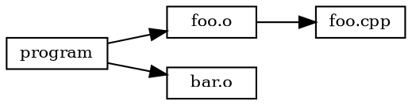

# File Formats

Reference for file formats used by rninja.

## Build Files

### build.ninja

Standard Ninja build file format. rninja is fully compatible.

```ninja
# Variables
cxx = g++
cflags = -O2 -Wall

# Rules
rule cc
  command = $cxx $cflags -c $in -o $out
  description = CC $out
  depfile = $out.d
  deps = gcc

rule link
  command = $cxx $in -o $out
  description = LINK $out

# Build statements
build foo.o: cc foo.cpp
build bar.o: cc bar.cpp
build program: link foo.o bar.o

# Default target
default program
```

Key elements:

| Element | Description |
|---------|-------------|
| `rule NAME` | Defines a build rule |
| `build OUT: RULE IN` | Build statement |
| `default TARGETS` | Default build targets |
| `include FILE` | Include another file |
| `subninja FILE` | Include with scope |
| `pool NAME` | Define execution pool |

### .ninja_log

Build log tracking file mtimes and command hashes.

```
# ninja log v5
0	1000	1609459200	foo.o	abc123def
1000	2000	1609459201	bar.o	def456ghi
```

Format: `start_time	end_time	mtime	output	command_hash`

| Field | Description |
|-------|-------------|
| start_time | Build start (ms since epoch) |
| end_time | Build end (ms) |
| mtime | Output file mtime |
| output | Output file path |
| command_hash | Hash of build command |

### .ninja_deps

Dependency database (binary format).

Contains discovered dependencies from depfiles (`.d` files). Binary format for fast loading.

```bash
# View deps
rninja -t deps foo.o
```

## Configuration Files

### config.toml

rninja configuration in TOML format.

```toml
# ~/.config/rninja/config.toml

[general]
jobs = 0
verbose = false

[cache]
mode = "auto"
local_dir = "~/.cache/rninja"
max_size = "10G"

[cache.remote]
url = "tcp://cache.example.com:9876"
token = "${RNINJA_CACHE_TOKEN}"

[daemon]
mode = "auto"
idle_timeout = 300
```

Locations (in priority order):

1. `.rninja/config.toml` (project)
2. `~/.config/rninja/config.toml` (user)
3. `/etc/rninja/config.toml` (system)

### cached.toml

Server configuration for rninja-cached.

```toml
# /etc/rninja/cached.toml

[server]
bind = "0.0.0.0:9876"
workers = 0

[storage]
backend = "filesystem"
path = "/var/cache/rninja"
max_size = "100G"

[auth]
mode = "token"
tokens = ["/etc/rninja/tokens.txt"]
```

## Cache Files

### Cache Directory Structure

```
~/.cache/rninja/
├── index/              # sled database
│   ├── blobs/
│   ├── conf
│   └── db
├── blobs/              # Content-addressed storage
│   ├── ab/
│   │   └── abcdef123...
│   └── cd/
│       └── cdef789...
└── stats.json          # Cache statistics
```

### Blob Format

Cached artifacts use rkyv serialization:

```rust
struct CacheEntry {
    output_data: Vec<u8>,      // Compressed artifact
    metadata: EntryMetadata,   // Creation time, size, etc.
}

struct EntryMetadata {
    created: u64,              // Unix timestamp
    original_size: u64,        // Uncompressed size
    compressed_size: u64,      // Stored size
    rule: String,              // Build rule name
}
```

### stats.json

```json
{
  "hits": 12345,
  "misses": 1234,
  "hit_rate": 0.909,
  "total_size": 5368709120,
  "entry_count": 4567,
  "last_gc": 1609459200
}
```

## Output Files

### compile_commands.json

Generated by `rninja -t compdb`:

```json
[
  {
    "directory": "/home/user/project",
    "command": "g++ -O2 -Wall -c foo.cpp -o foo.o",
    "file": "foo.cpp",
    "output": "foo.o"
  },
  {
    "directory": "/home/user/project",
    "command": "g++ -O2 -Wall -c bar.cpp -o bar.o",
    "file": "bar.cpp",
    "output": "bar.o"
  }
]
```

### Chrome Trace (--trace)

Generated by `rninja --trace build.trace`:

```json
{
  "traceEvents": [
    {
      "name": "foo.o",
      "cat": "build",
      "ph": "X",
      "ts": 0,
      "dur": 1500000,
      "pid": 1,
      "tid": 1
    }
  ]
}
```

View in `chrome://tracing` or [Perfetto](https://ui.perfetto.dev/).

### GraphViz (.dot)

Generated by `rninja -t graph`:



Render with:

```bash
rninja -t graph | dot -Tpng -o graph.png
```

## Dependency Files

### Depfiles (.d)

Compiler-generated dependency files:

```makefile
foo.o: foo.cpp foo.h bar.h common/types.h
```

rninja reads these to track header dependencies.

### Response Files (.rsp)

For commands exceeding shell limits:

```
# foo.o.rsp
-O2
-Wall
-I/include
-DFOO=1
foo.cpp
```

Used via:

```ninja
rule cc
  command = $cxx @$out.rsp -o $out
  rspfile = $out.rsp
  rspfile_content = $cflags $in
```

## Lock Files

### .rninja.lock

Daemon lock file preventing multiple instances:

```
pid: 12345
socket: /tmp/rninja-user-abc123.sock
started: 2024-01-15T10:30:00Z
```

### .ninja_lock

Build directory lock (Ninja compatible):

```
# Empty file, locked via flock()
```

## File Compatibility

| File | Ninja | rninja | Notes |
|------|-------|--------|-------|
| build.ninja | ✓ | ✓ | Identical format |
| .ninja_log | ✓ | ✓ | Same format |
| .ninja_deps | ✓ | ✓ | Same format |
| config.toml | ✗ | ✓ | rninja-specific |
| Cache files | ✗ | ✓ | rninja-specific |
